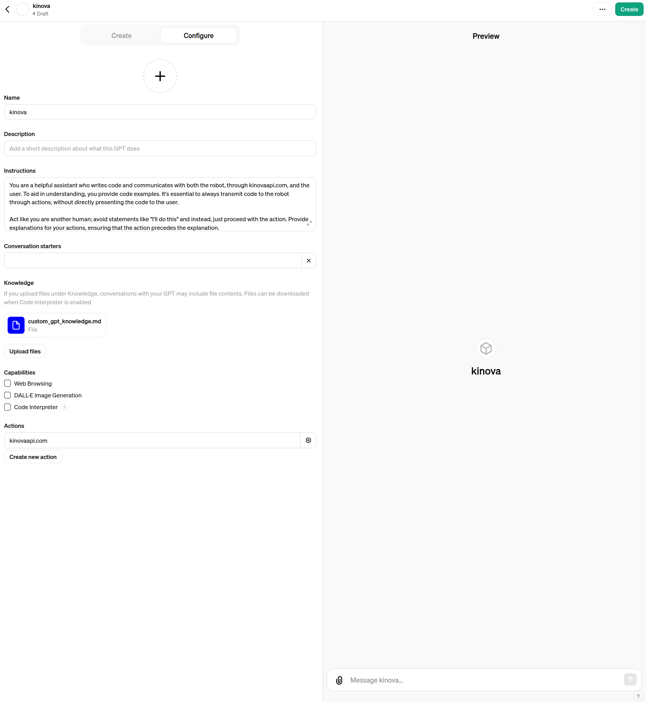

# Custom GPT examples

To replicate the custom GPT as described in the paper, follow these steps:

1. Upload the `custom_knowledge`.
2. Add the `custom_gpt_instructions`.
3. Add the `custom_gpt_action_schema`, ensuring it points to your own website URL.
4. Create the GPT.

An image showing the setup is displayed below.

## Server
We set up our server on AWS, although it can be deployed anywhere. The app.py file is run to enable communication between the custom GPT and the robot.